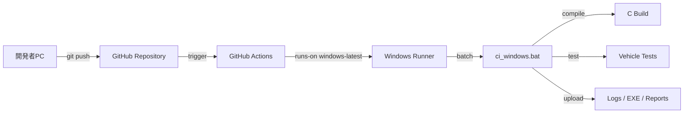

# Codex依頼プロンプト1：無料GitHub ActionsでWindows C言語CIデモを作成

機密情報を含まない、車載ソフト風のC言語CI/CDデモ用リポジトリを作成してください。

目的は、お客様に以下を見せることです。

* GitHubへpushするとGitHub Actionsが自動起動する
* Windows Runner上でバッチ処理が実行される
* C言語コードがビルドされる
* 車載ソフト風のテストが実行される
* CIログを見ると「何をしているか」が理解できる
* 成果物としてexe、ログ、テスト結果レポートが残る

## 前提

* GitHub-hosted runnerを使う
* OSはWindowsを使う
* `runs-on: windows-latest` または `windows-2022`
* 外部の有償ツール、CS+、QAC、WinAMSは使わない
* C言語の標準的なビルドだけで完結させる
* 可能ならMSVCを使う
* MSVCのPATH設定が必要なら、GitHub ActionsでVisual Studio Developer Command Prompt相当を使う
* どうしてもMSVCが難しい場合はCMakeを使ってWindows上で確実にビルドできる構成にする

## 作成してほしい構成

以下のような構成にしてください。

```text
vehicle-cicd-demo/
├─ .github/
│  └─ workflows/
│     └─ windows-c-ci.yml
├─ src/
│  ├─ main.c
│  ├─ vehicle_control.c
│  └─ vehicle_control.h
├─ tests/
│  └─ test_vehicle_control.c
├─ scripts/
│  └─ ci_windows.bat
├─ build/
│  └─ .gitkeep
├─ docs/
│  ├─ demo_scenario.md
│  └─ ci_flow.md
├─ AGENTS.md
└─ README.md
```

## C言語のテストシナリオ

車載ソフト風のサンプルとして、以下の3領域を作ってください。

### 1. 温度計測

* `check_temperature_status(int temperature_c)` のような関数を作る
* 正常範囲、警告範囲、異常範囲を判定する
* 例：

  * 25℃: 正常
  * 85℃: 警告
  * 105℃: 異常
  * -40℃未満や150℃超過: センサー異常

### 2. 照明オンオフ

* `decide_headlamp_state(int ambient_lux, int ignition_on)` のような関数を作る
* 暗い場合かつイグニッションONならライトON
* 明るい場合、またはイグニッションOFFならライトOFF
* テストケースでON/OFFを確認する

### 3. CAN通信判定

* `validate_can_frame(unsigned int can_id, int dlc)` のような関数を作る
* 想定CAN ID、DLCの範囲をチェックする
* 例：

  * CAN ID 0x123、DLC 8なら正常
  * DLCが8超過なら異常
  * 想定外IDなら異常
* 実際のCAN通信は不要。あくまで判定ロジックのデモでよい

## テスト実装

* 外部テストフレームワークは使わず、C言語だけでテストを実装する
* `ASSERT_EQ` のような簡単なマクロを自作してよい
* テスト失敗時はexit code 1でCIを失敗させる
* テスト成功時はexit code 0で終了する
* テスト実行時に以下のようなログを出す

```text
[TEST] Temperature normal case ... PASS
[TEST] Temperature warning case ... PASS
[TEST] Headlamp ON case ... PASS
[TEST] CAN valid frame case ... PASS
```

## GitHub Actions

`.github/workflows/windows-c-ci.yml` を作成してください。

要件：

* push時に自動実行
* pull_request時にも実行
* workflow_dispatchで手動実行も可能
* Windows Runnerで実行
* checkoutする
* `scripts\ci_windows.bat` を実行する
* ビルドログ、テストログ、exe、レポートをartifactとしてアップロードする
* Actions画面で見たときに、各ステップ名だけで何をしているか分かるようにする

ステップ名の例：

* Checkout source code
* Prepare Windows build directory
* Build vehicle C demo
* Run vehicle scenario tests
* Generate CI summary
* Upload CI artifacts

## バッチ処理

`scripts\ci_windows.bat` を作成してください。

このバッチで以下を行ってください。

1. buildディレクトリ作成
2. logsディレクトリ作成
3. Cコードのビルド
4. テストexeの実行
5. デモ用exeの実行
6. ログ出力
7. Markdown形式のCIサマリ作成
8. 失敗した場合はエラーコードを返す

成果物は以下のようにしてください。

```text
build/
├─ vehicle_demo.exe
├─ vehicle_tests.exe
├─ logs/
│  ├─ build.log
│  ├─ test.log
│  └─ run_demo.log
└─ reports/
   └─ ci_summary.md
```

## READMEに書いてほしいこと

README.mdには以下を書いてください。

* このデモの目的
* お客様に見せるポイント
* pushするとActionsが動くこと
* Windows上でC言語のビルド・テストをしていること
* 温度計測、照明オンオフ、CAN通信判定のテスト内容
* 成果物の見方
* ローカルWindowsで `scripts\ci_windows.bat` を実行する方法
* CS+やQACなどの本番ツールに置き換える場合の考え方

## docs/demo_scenario.md

お客様説明用に、以下のような短い説明資料をMarkdownで作ってください。

* 今回は機密情報なしのC言語サンプルでCI/CDの流れを確認する
* GitHubへpush
* GitHub Actions起動
* Windows Runnerでバッチ実行
* Cコードをビルド
* 車載風テストを実行
* 成果物・ログを保存
* 次段階ではCS+導入済みWindows self-hosted runnerへ置き換える

## docs/ci_flow.md

Mermaid記法でCIの流れを図解してください。

例：



## AGENTS.md

Codex向けの作業ルールとして、AGENTS.mdも作ってください。

内容：

* このリポジトリは車載C言語CI/CDデモである
* 外部有償ツールは使わない
* Windows GitHub Actionsで動くことを優先する
* `scripts\ci_windows.bat` がCIの中心
* 修正後は可能な範囲でローカル確認する
* READMEとdocsも更新する

## 完了条件

以下を満たしたら完了です。

* `git push` でGitHub Actionsが動くworkflowがある
* Windows RunnerでCコードをビルドできる
* テストが成功・失敗をexit codeで返す
* CIログを見れば何をしているか分かる
* artifactにexe、ログ、レポートが残る
* READMEだけ見ればデモ説明ができる
* 機密情報や実プロジェクト名は含めない
