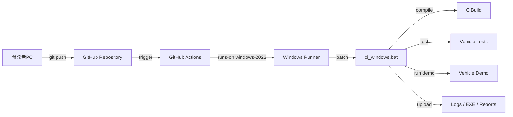

# CI Flow

```mermaid
flowchart LR
  Dev[開発者PC] -->|git push| GitHub[GitHub Repository]
  GitHub -->|trigger| Actions[GitHub Actions]
  Actions -->|runs-on windows-2022| Win[Windows Runner]
  Win -->|batch| Bat[ci_windows.bat]
  Bat -->|compile| Build[C Build]
  Bat -->|test| Test[Vehicle Tests]
  Bat -->|run demo| Demo[Vehicle Demo]
  Bat -->|upload| Artifacts[Logs / EXE / Reports]
```
